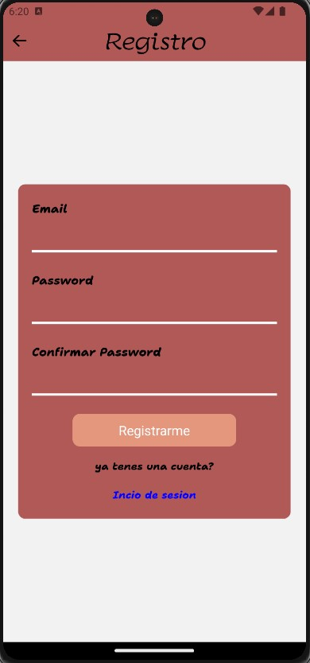
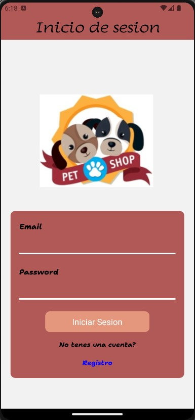
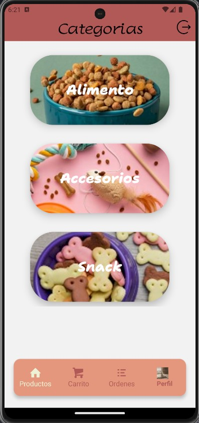
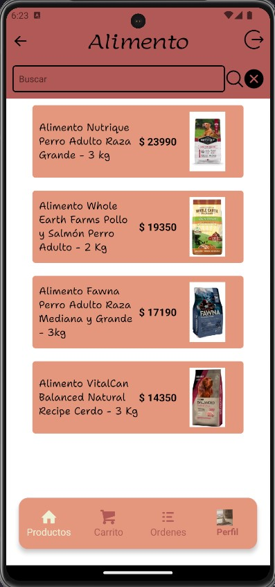
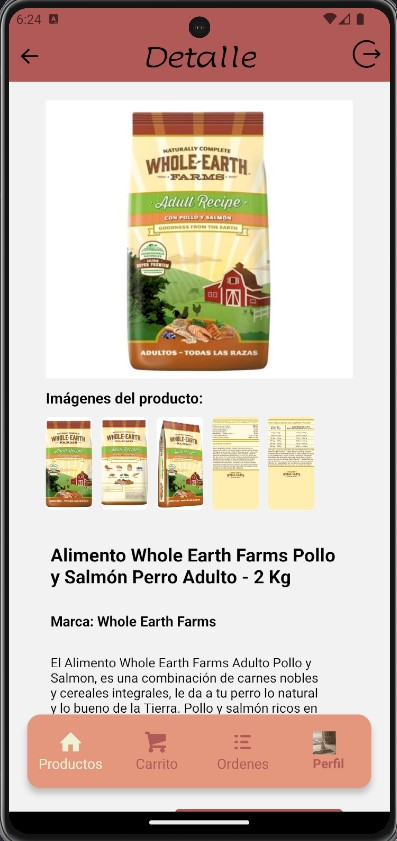
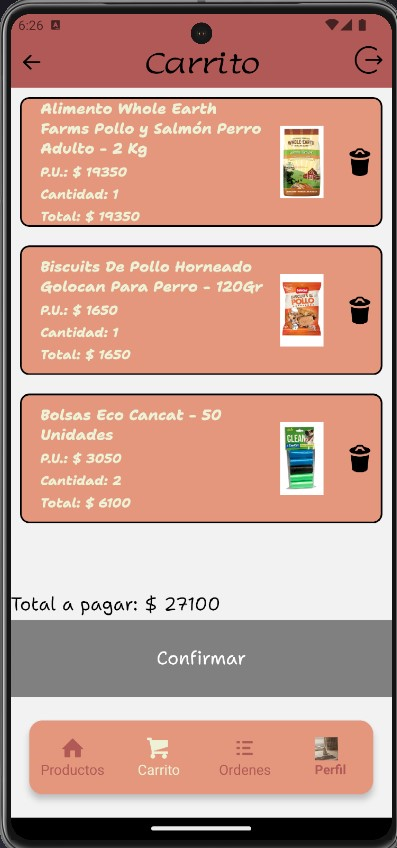
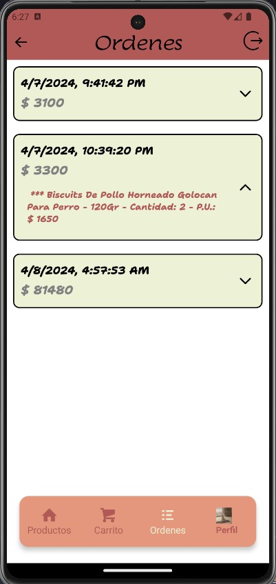
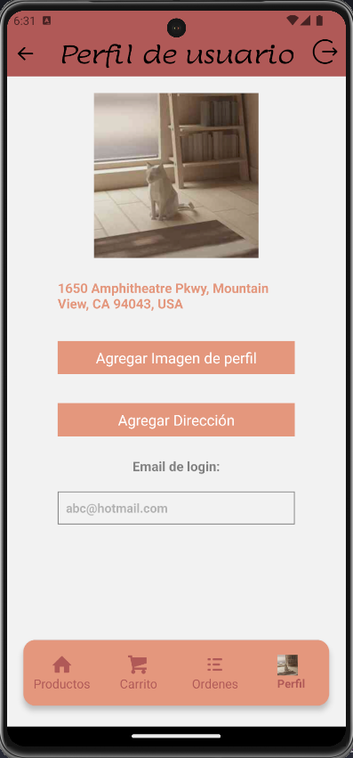
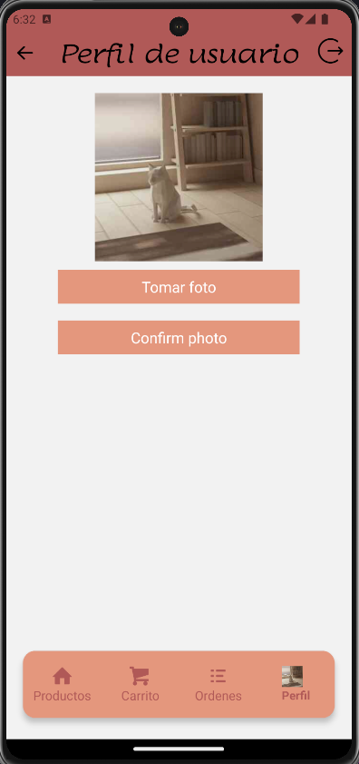
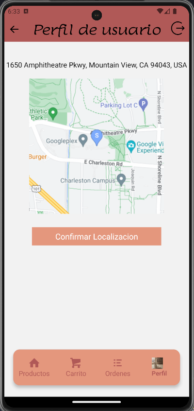

 🤖 Android app:
https://expo.dev/artifacts/eas/w9u7Yr5PF7MefxE2RQM6fX.apk

# Petshop E-Commerce App - React Native

Una aplicación de comercio electrónico desarrollada con React Native que ofrece una experiencia de compra completa y fácil de usar para quienes desean adquirir productos para sus mascotas (Alimento, Accesorios, Snack).

## Funcionalidades Principales

### Pantalla de Cuenta

- **Acceso seguro:** Solo los usuarios autenticados pueden acceder a la pantalla de perfil y realizar compras.




### Autenticación con Firebase

- Utiliza el sistema de autenticación de Firebase para gestionar el acceso de usuarios.
- Permite a los usuarios iniciar sesión y registrarse de manera segura.

### Pantalla de Categorías

- Muestra una selección de categorías en tarjetas.
- Al hacer clic en una categoría, se navega a la pantalla de productos correspondiente.

### Pantalla de Productos

- Lista todos los productos en tarjetas con titulo, precio y foto.
- Incluye un buscador para filtrar productos por nombre.
- Al hacer clic en un producto, se navega a la pantalla de detalles del producto.

### Pantalla de Detalles del Producto

- Ofrece, en caso de existir, más imagenes del producto.
- Proporciona el nombre del producto, la marca y una descripción detallada del producto.
- Muestra el precio.
- Permite agregar el producto al carrito.





### Navegación Inferior

```javascript

const TabNavigator = () => {
    const localId = useSelector(state => state.auth.localId)
    const {data} = useGetImageQuery(localId)
    
    return (
        <Tab.Navigator
                    initialRouteName='ShopStack'
                    screenOptions={{
                        headerShown:false,
                        tabBarShowLabel:false,
                        tabBarStyle: styles.tabBar


                    }}
            >
                <Tab.Screen 
                    name='ShopStack'
                    component={ShopStack}
                    options={{
                        tabBarIcon: ({focused}) => 
                        <TabBarIcon title="Productos" nameIcon="home" focused={focused}/>
                    }}
                />
                <Tab.Screen 
                        name='CartStack' 
                        component={CartStack}
                        options={{
                            tabBarIcon: ({focused}) => 
                            <TabBarIcon title="Carrito" nameIcon="shopping-cart" focused={focused}/>
                        }}

                />
                <Tab.Screen 
                        name='OrdersStack' 
                        component={OrdersStack}
                        options={{
                            tabBarIcon: ({focused}) => <TabBarIcon title="Ordenes" nameIcon="list" focused={focused}/>
                        }}
                />
                <Tab.Screen 
                        name='ProfileStack' 
                        component={ProfileStack}
                        options={{
                            tabBarIcon: ({focused}) => {
                            if(data){
                                return  <View>
                                        <Image
                                            source={{uri:data.image}}
                                            style={styles.image}
                                            resizeMode='cover' />
                                        <Text style={styles.perfil}>Perfil</Text>
                                        </View>
                            }
                            return  <TabBarIcon title="Perfil" nameIcon="user" focused={focused}/>
                        }
                        }}
                />
        </Tab.Navigator>
  )
}

```

- **Pestaña 1 - Productos:** Categorías y productos (stack principal).
- **Pestaña 2 - Carrito:** Detalles del carrito de compras con resumen y botón para finalizar la orden.
- **Pestaña 3 - Órdenes:** Historial de órdenes realizadas.
- **Pestaña 4 - Perfil:** Información del usuario, ubicación y carga de imagen de perfil.







## Tecnologías Utilizadas

- **Firebase Authentication:** Implementa el sistema de autenticación de Firebase para gestionar la seguridad de la aplicación.
- **React Native Navigation Stack:** Gestiona la navegación entre pantallas.
- **React Native Navigation Buttom tap:** Gestiona la navegación entre pestañas.
- **Expo-Location:** Permite acceder y gestionar la ubicación del usuario.
- **Expo-Picker-Image:** Facilita la carga de imágenes de perfil.
- **Redux:** Centraliza y gestiona el estado de la aplicación.
- **RTK Query y Firebase:** Realiza operaciones de lectura/escritura en la base de datos.

## Instalación

1. Clona el repositorio: `git clone https://github.com/tu-usuario/tu-aplicacion.git`
2. Instala las dependencias: `npm install`
3. Configura las claves de API para servicios externos (Expo-Location, Firebase, etc.).
4. Configura las credenciales de Firebase en tu proyecto.
5. Ejecuta la aplicación: `npm start`

## Contacto

Para preguntas o soporte, contacta a flores_laura14@outlook.com